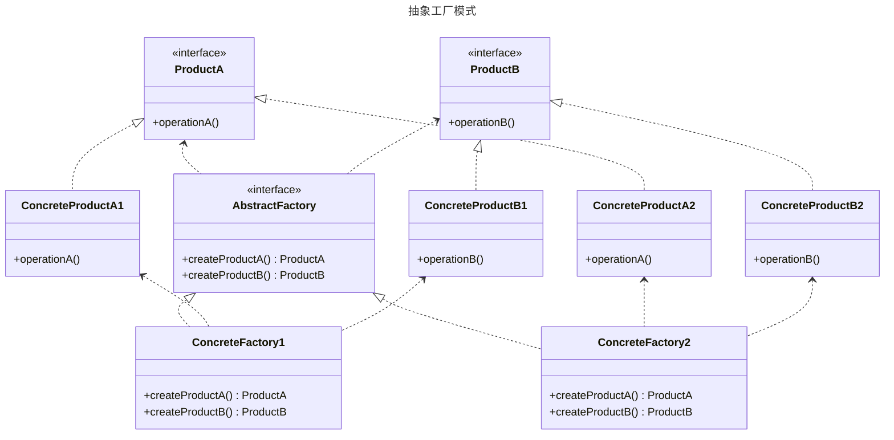

```mermaid
---
title: 抽象工厂模式
---
classDiagram
    class ProductA {
        <<interface>>
        +operationA()
    }
    class ConcreteProductA1 {
        +operationA()
    }
    class ConcreteProductA2 {
        +operationA()
    }
    class ProductB {
        <<interface>>
        +operationB()
    }
    class ConcreteProductB1 {
        +operationB()
    }
    class ConcreteProductB2 {
        +operationB()
    }
    class AbstractFactory {
        <<interface>>
        +createProductA() ProductA
        +createProductB() ProductB
    }
    class ConcreteFactory1 {
        +createProductA() ProductA
        +createProductB() ProductB
    }
    class ConcreteFactory2 {
        +createProductA() ProductA
        +createProductB() ProductB
    }
    ProductA <|.. ConcreteProductA1
    ProductA <|.. ConcreteProductA2 
    ProductB <|.. ConcreteProductB1 
    ProductB <|.. ConcreteProductB2 
    AbstractFactory <|.. ConcreteFactory1
    AbstractFactory <|.. ConcreteFactory2
    ProductA <.. AbstractFactory
    ProductB <.. AbstractFactory
    ConcreteProductA1 <.. ConcreteFactory1
    ConcreteProductB1 <.. ConcreteFactory1
    ConcreteProductA2 <.. ConcreteFactory2
    ConcreteProductB2 <.. ConcreteFactory2
```