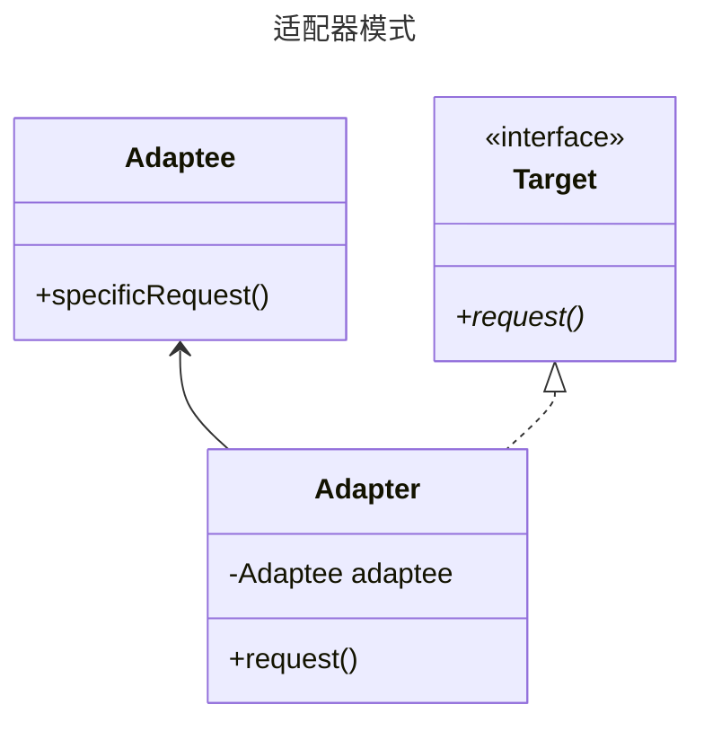

```mermaid
---
title: 适配器模式
---
classDiagram
    class Target {
        <<interface>>
        +request()*
    }
    class Adaptee {
        +specificRequest()
    }
    class Adapter {
        -Adaptee adaptee
        +request()
    }
    Adaptee<-- Adapter
    Target <|.. Adapter
```