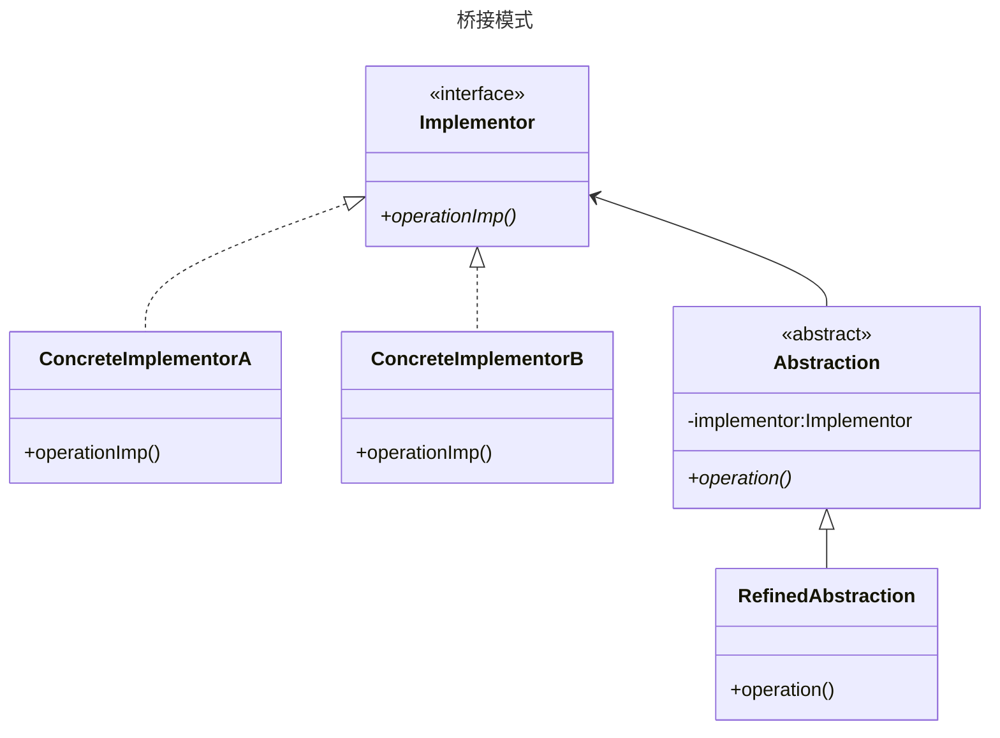

```mermaid
---
title: 桥接模式
---
classDiagram
    class Implementor{
        <<interface>>
        +operationImp()*
    }
    class ConcreteImplementorA{
        +operationImp()
    }
    class ConcreteImplementorB{
        +operationImp()
    }
    class Abstraction{
        <<abstract>>
        -implementor:Implementor
        +operation()*
    }
    class RefinedAbstraction{
        +operation()
    }
    Implementor <|.. ConcreteImplementorA
    Implementor <|.. ConcreteImplementorB
    Abstraction <|-- RefinedAbstraction
    Implementor <-- Abstraction
```