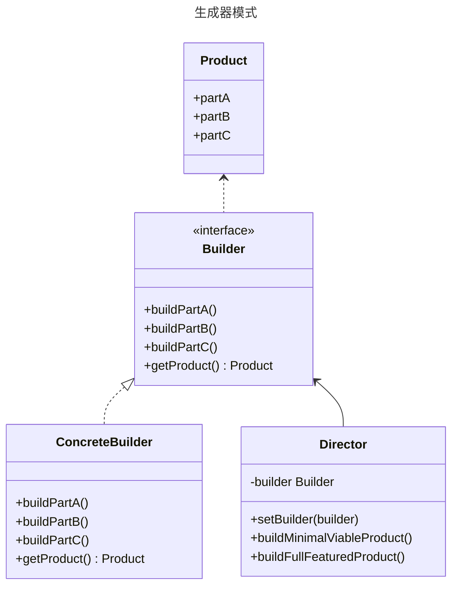

```mermaid
---
title: 生成器模式
---
classDiagram
    class Product {
        +partA
        +partB
        +partC
    }
    class Builder {
        <<interface>>
        +buildPartA()
        +buildPartB()
        +buildPartC()
        +getProduct() Product
    }
    class ConcreteBuilder {
        +buildPartA()
        +buildPartB()
        +buildPartC()
        +getProduct() Product
    }
    class Director {
        -builder Builder
        +setBuilder(builder)
        +buildMinimalViableProduct()
        +buildFullFeaturedProduct()
    }
    Product <.. Builder
    Builder <|.. ConcreteBuilder
    Builder <-- Director
```