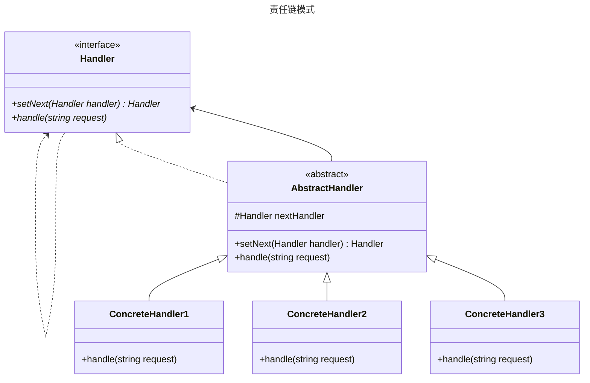

```mermaid
---
title: 责任链模式
---
classDiagram
    class Handler {
        <<interface>>
        +setNext(Handler handler)* Handler
        +handle(string request)*
    }
    class AbstractHandler {
        <<abstract>>
        #Handler nextHandler
        +setNext(Handler handler) Handler
        +handle(string request)
    }
    class ConcreteHandler1 {
        +handle(string request)
    }
    class ConcreteHandler2 {
        +handle(string request)
    }
    class ConcreteHandler3 {
        +handle(string request)
    }
    Handler <.. Handler
    Handler <|.. AbstractHandler
    Handler <-- AbstractHandler
    AbstractHandler <|-- ConcreteHandler1
    AbstractHandler <|-- ConcreteHandler2
    AbstractHandler <|-- ConcreteHandler3
```