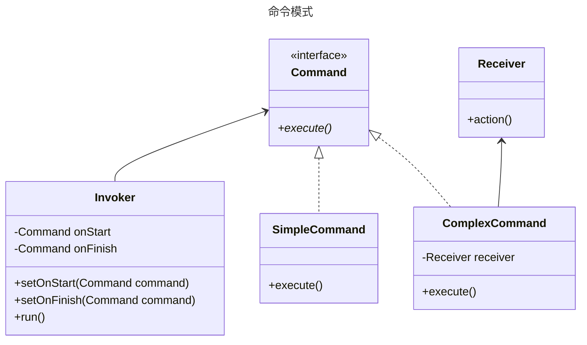

```mermaid
---
title: 命令模式
---
classDiagram
    class Command{
        <<interface>>
        +execute()*
    }
    class SimpleCommand {
        +execute()
    }
    class ComplexCommand {
        -Receiver receiver
        +execute()
    }
    class Receiver {
        +action()
    }
    class Invoker {
        -Command onStart
        -Command onFinish
        +setOnStart(Command command)
        +setOnFinish(Command command)
        +run()
    }
    Command <-- Invoker
    Command <|.. SimpleCommand 
    Command <|.. ComplexCommand 
    Receiver <-- ComplexCommand 
```