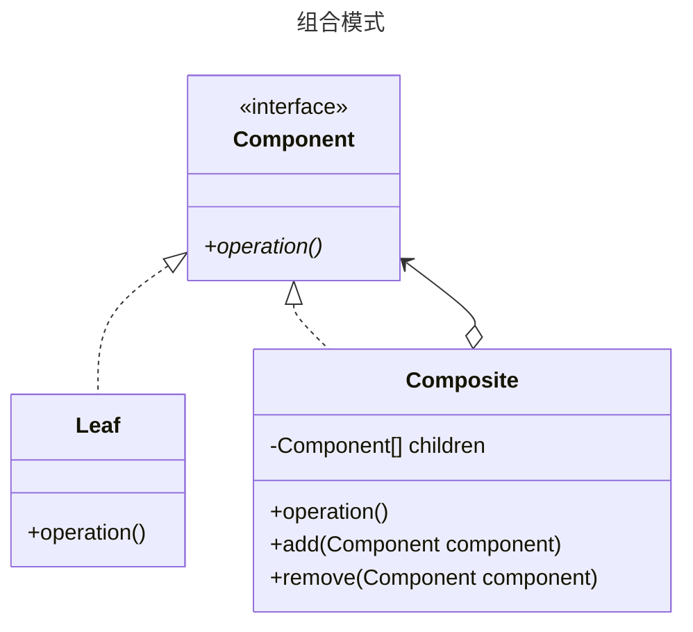

```mermaid
---
title: 组合模式
---
classDiagram
    class Component {
        <<interface>>
        +operation()*
    }
    class Leaf {
        +operation()
    }
    class Composite {
        -Component[] children
        +operation()
        +add(Component component)
        +remove(Component component)
    }
    Component <|.. Leaf
    Component <|.. Composite
    Component <--o Composite
```