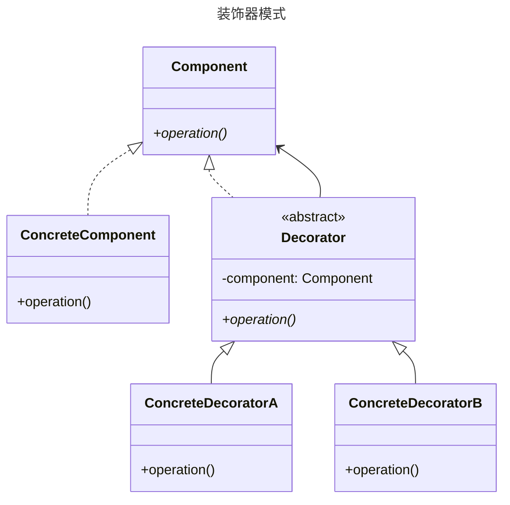

```mermaid
---
title: 装饰器模式
---
classDiagram
    class Component{
        +operation()*
    }
    class ConcreteComponent {
        +operation()
    }
    class Decorator {
        <<abstract>>
        -component: Component
        +operation()*
    }
    class ConcreteDecoratorA {
        +operation()
    }
    class ConcreteDecoratorB {
        +operation()
    }
    Component <|.. ConcreteComponent
    Component <|.. Decorator
    Component <-- Decorator
    Decorator <|-- ConcreteDecoratorA
    Decorator <|-- ConcreteDecoratorB
```