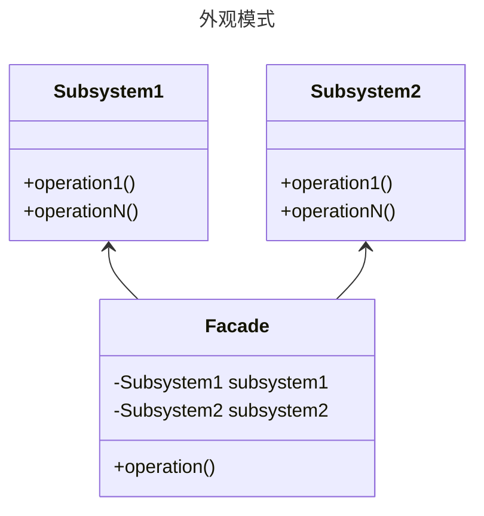

```mermaid
---
title: 外观模式
---
classDiagram
    class Subsystem1{
        +operation1()
        +operationN()
    }
    class Subsystem2{
        +operation1()
        +operationN()
    }
    class Facade{
        -Subsystem1 subsystem1
        -Subsystem2 subsystem2
        +operation()
    }
    Subsystem1 <-- Facade
    Subsystem2 <-- Facade
```