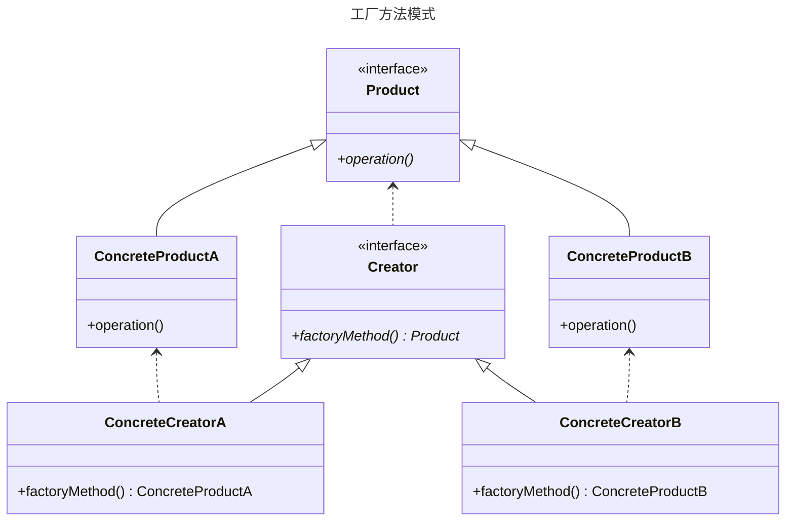

```mermaid
---
title: 工厂方法模式
---
classDiagram
    class Product {
        <<interface>>
        +operation()*
    }
    class ConcreteProductA {
        +operation()
    }
    class ConcreteProductB {
        +operation()
    }
    class Creator {
        <<interface>>
        +factoryMethod()* Product
    }
    class ConcreteCreatorA {
        +factoryMethod() ConcreteProductA
    }
    class ConcreteCreatorB {
        +factoryMethod() ConcreteProductB
    }
    Product <|-- ConcreteProductA
    Product <.. Creator
    Product <|-- ConcreteProductB
    ConcreteProductA <.. ConcreteCreatorA
    Creator <|-- ConcreteCreatorA
    Creator <|-- ConcreteCreatorB
    ConcreteProductB <.. ConcreteCreatorB
```