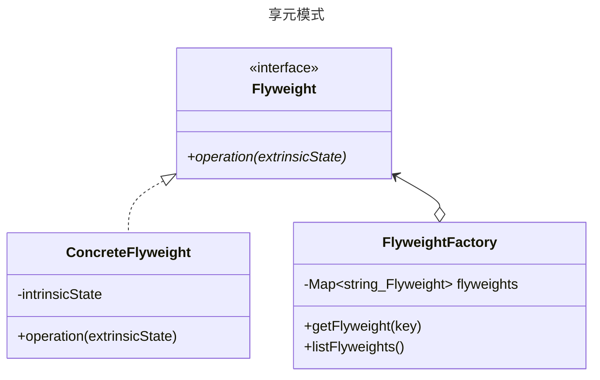

```mermaid
---
title: 享元模式
---
classDiagram
    class Flyweight {
        <<interface>>
        +operation(extrinsicState)*
    }
    class ConcreteFlyweight {
        -intrinsicState
        +operation(extrinsicState)
    }
    class FlyweightFactory {
        -Map~string_Flyweight~ flyweights
        +getFlyweight(key)
        +listFlyweights()
    }
    
    Flyweight <|.. ConcreteFlyweight
    Flyweight <--o FlyweightFactory
```