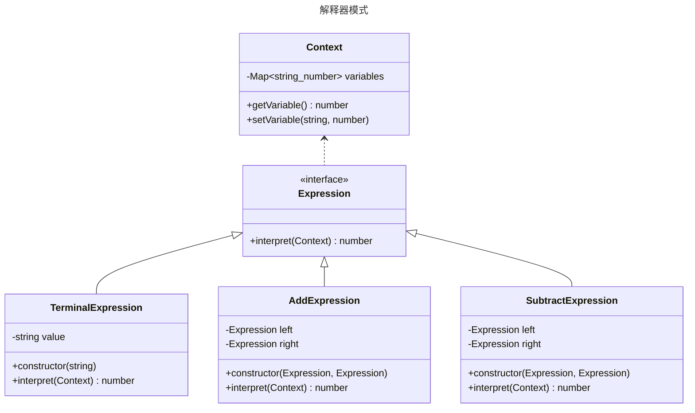

```mermaid
---
title: 解释器模式
---
classDiagram
    class Context {
        -Map~string_number~ variables
        +getVariable() number
        +setVariable(string, number)
    }
    class Expression {
        <<interface>>
        +interpret(Context) number
    }
    class TerminalExpression {
        -string value
        +constructor(string)
        +interpret(Context) number
    }
    class AddExpression {
        -Expression left
        -Expression right
        +constructor(Expression, Expression)
        +interpret(Context) number
    }
    class SubtractExpression {
        -Expression left
        -Expression right
        +constructor(Expression, Expression)
        +interpret(Context) number
    }
    Context <.. Expression
    Expression <|-- TerminalExpression
    Expression <|-- AddExpression
    Expression <|-- SubtractExpression
```