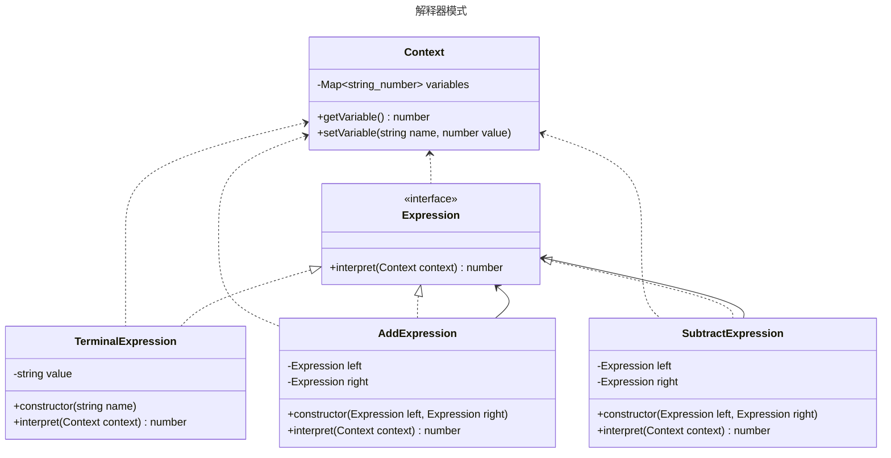

```mermaid
---
title: 解释器模式
---
classDiagram
    class Context {
        -Map~string_number~ variables
        +getVariable() number
        +setVariable(string name, number value)
    }
    class Expression {
        <<interface>>
        +interpret(Context context) number
    }
    class TerminalExpression {
        -string value
        +constructor(string name)
        +interpret(Context context) number
    }
    class AddExpression {
        -Expression left
        -Expression right
        +constructor(Expression left, Expression right)
        +interpret(Context context) number
    }
    class SubtractExpression {
        -Expression left
        -Expression right
        +constructor(Expression left, Expression right)
        +interpret(Context context) number
    }
    Context <.. Expression
    Context <.. TerminalExpression
    Context <.. AddExpression
    Context <.. SubtractExpression
    Expression <|.. TerminalExpression
    Expression <|.. AddExpression
    Expression <|.. SubtractExpression
    Expression <-- AddExpression
    Expression <-- SubtractExpression
```