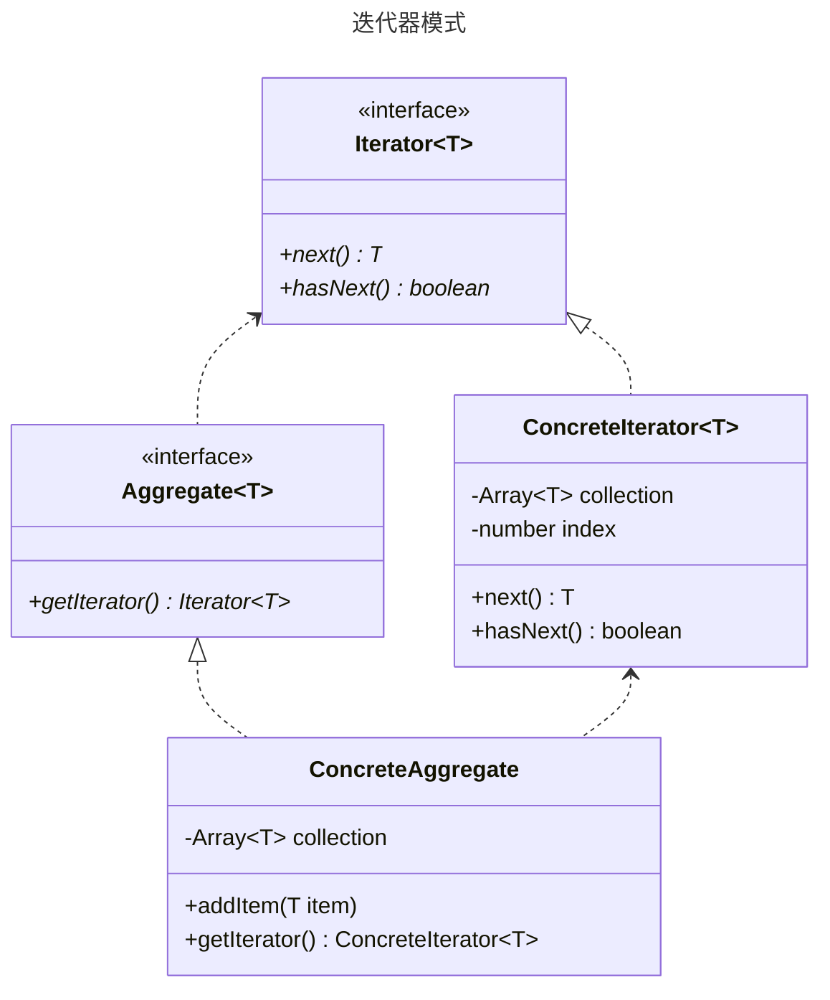

```mermaid
---
title: 迭代器模式
---
classDiagram
    class Iterator~T~ {
        <<interface>>
        +next()* T
        +hasNext()* boolean
    }
    class ConcreteIterator~T~ {
        -Array~T~ collection
        -number index
        +next() T
        +hasNext() boolean
    }
    class Aggregate~T~ {
        <<interface>>
        +getIterator()* Iterator~T~
    }
    class ConcreteAggregate {
        -Array~T~ collection
        +addItem(T item)
        +getIterator() ConcreteIterator~T~
    }
    Iterator <|.. ConcreteIterator
    Aggregate <|.. ConcreteAggregate
    Iterator <.. Aggregate
    ConcreteIterator <.. ConcreteAggregate
```