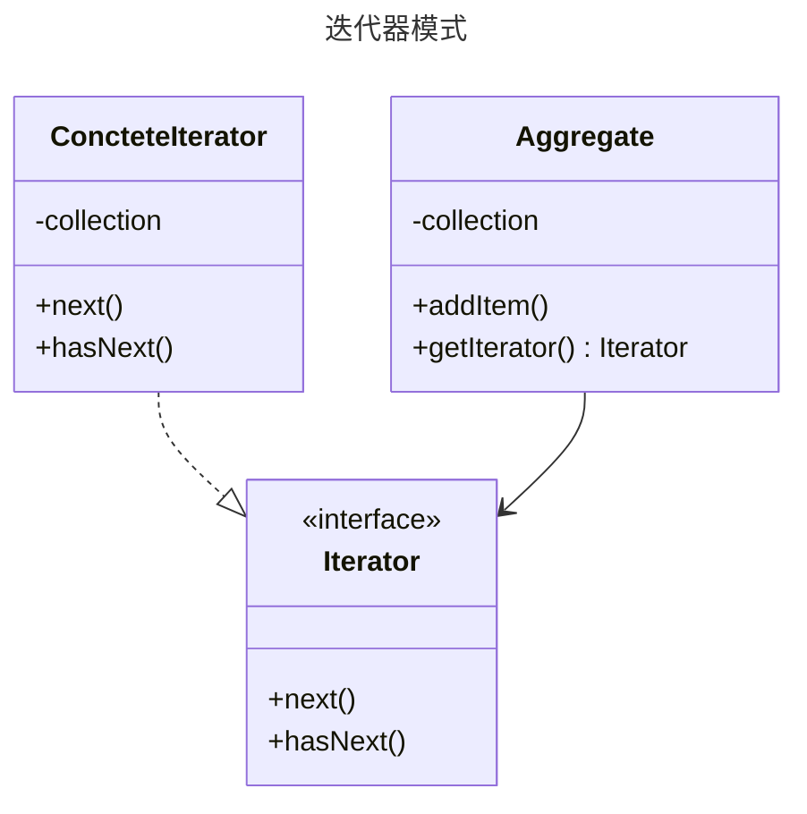

```mermaid
---
title: 迭代器模式
---
classDiagram
    class Iterator {
        <<interface>>
        +next()
        +hasNext()
    }
    class ConcteteIterator {
        -collection
        +next()
        +hasNext()
    }
    class Aggregate {
        -collection
        +addItem()
        +getIterator() Iterator
    }
    ConcteteIterator ..|> Iterator
    Aggregate --> Iterator
```