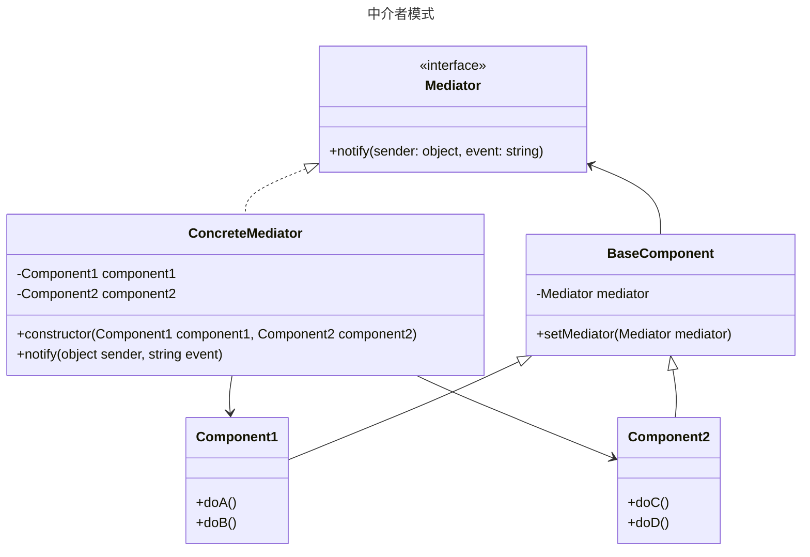

```mermaid
---
title: 中介者模式
---
classDiagram
    class Mediator {
        <<interface>>
        +notify(sender: object, event: string)
    }
    class ConcreteMediator {
        -Component1 component1
        -Component2 component2
        +constructor(Component1 component1, Component2 component2)
        +notify(object sender, string event)
    }
    class BaseComponent {
        -Mediator mediator
        +setMediator(Mediator mediator)
    }
    class Component1 {
        +doA()
        +doB()
    }
    class Component2 {
        +doC()
        +doD()
    }
    Mediator <|.. ConcreteMediator
    Mediator <-- BaseComponent
    ConcreteMediator --> Component1
    ConcreteMediator --> Component2
    BaseComponent <|-- Component1
    BaseComponent <|-- Component2
```