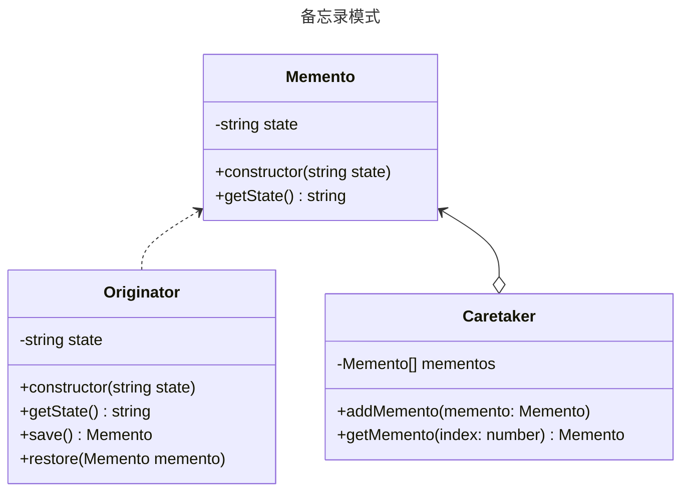

```mermaid
---
title: 备忘录模式
---
classDiagram
    class Memento {
        -string state
        +constructor(string state)
        +getState() string
    }
    class Originator {
        -string state
        +constructor(string state)
        +getState() string
        +save() Memento
        +restore(Memento memento)
    }
    class Caretaker {
        -Memento[] mementos
        +addMemento(memento: Memento)
        +getMemento(index: number) Memento
    }
    Memento <.. Originator 
    Memento <--o Caretaker 
```