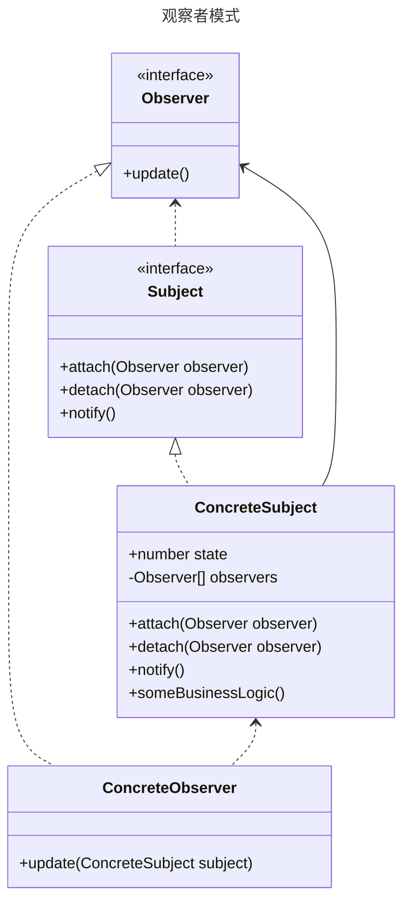

```mermaid
---
title: 观察者模式
---
classDiagram
    class Observer{
        <<interface>>
        +update()
    }
    class ConcreteObserver {
        +update(ConcreteSubject subject)
    }
    class Subject{
        <<interface>>
        +attach(Observer observer)
        +detach(Observer observer)
        +notify()
    }
    class ConcreteSubject {
        +number state
        -Observer[] observers
        +attach(Observer observer)
        +detach(Observer observer)
        +notify()
        +someBusinessLogic()
    }
    Observer <|.. ConcreteObserver 
    Subject <|.. ConcreteSubject 
    Observer <.. Subject 
    ConcreteSubject <.. ConcreteObserver 
    Observer <-- ConcreteSubject
```