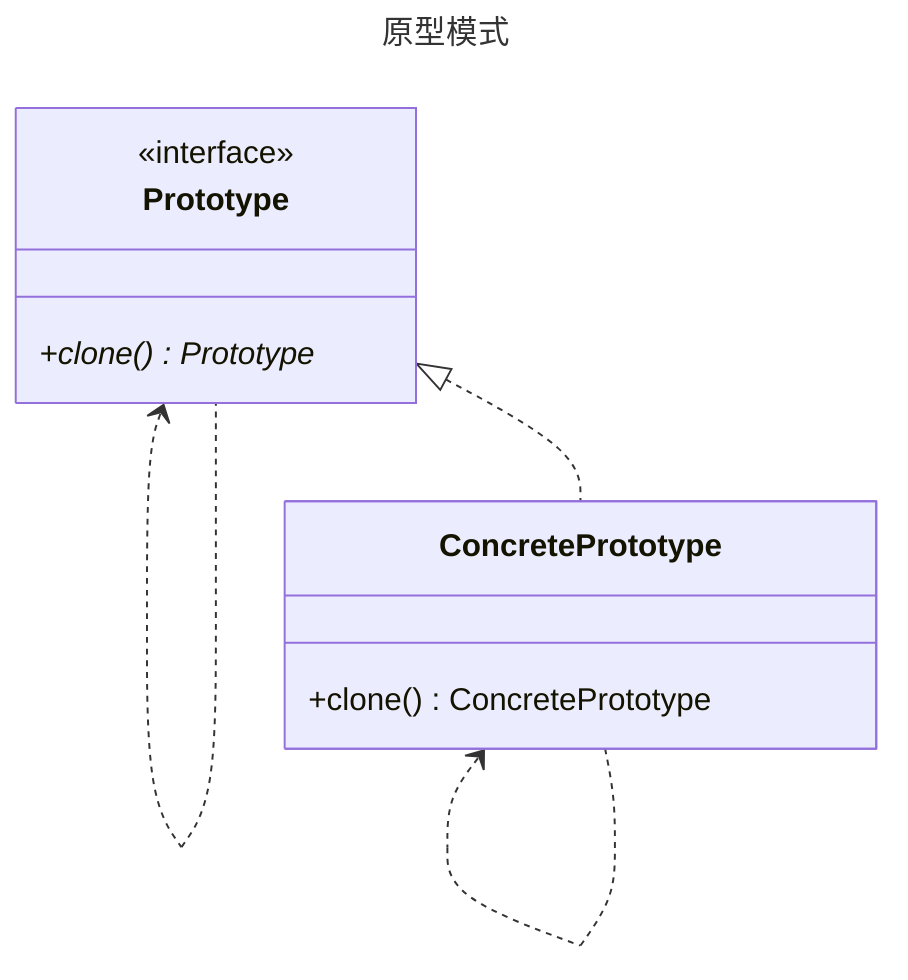

```mermaid
---
title: 原型模式
---
classDiagram
    class Prototype {
        <<interface>>
        +clone()* Prototype
    }
    class ConcretePrototype {
        +clone() ConcretePrototype
    }
    Prototype <.. Prototype
    Prototype <|.. ConcretePrototype
    ConcretePrototype <.. ConcretePrototype
```