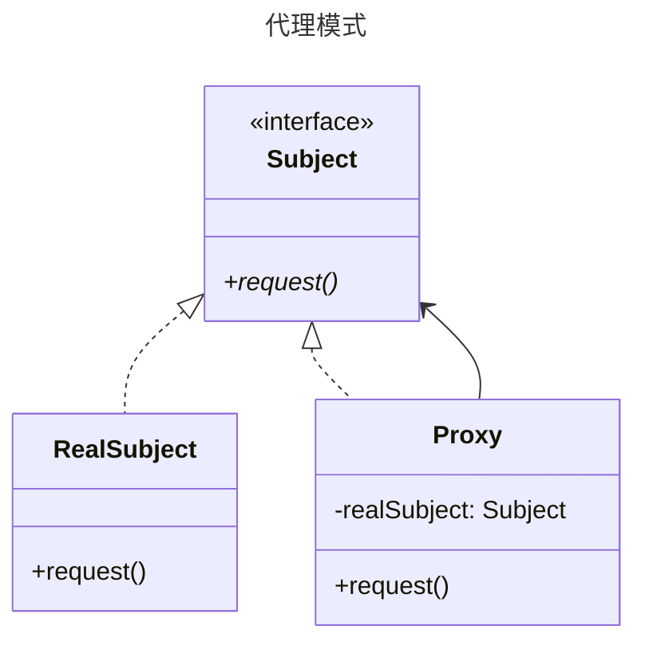

```mermaid
---
title: 代理模式
---
classDiagram
    class Subject {
        <<interface>>
        +request()*
    }
    class RealSubject {
        +request()
    }
    class Proxy {
        -realSubject: Subject
        +request()
    }
    Subject <|.. RealSubject
    Subject <|.. Proxy
    Subject <-- Proxy
```