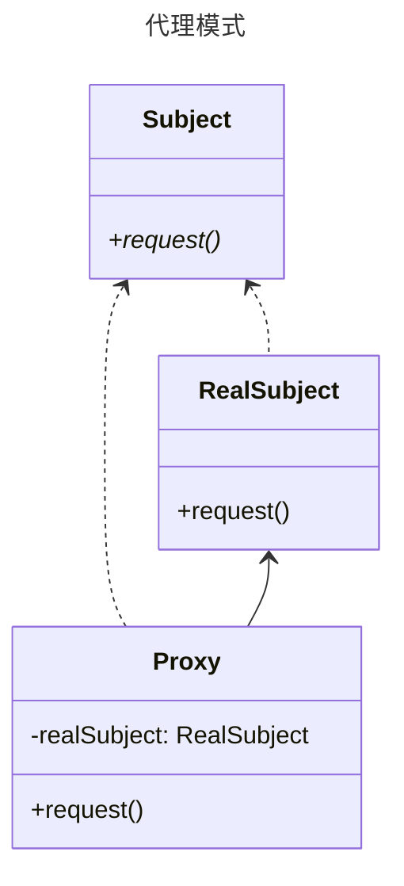

```mermaid
---
title: 代理模式
---
classDiagram
    class Subject{
        +request()*
    }
    class RealSubject{
        +request()
    }
    class Proxy{
        -realSubject: RealSubject
        +request()
    }
    Subject <.. RealSubject
    Subject <.. Proxy
    RealSubject <-- Proxy
```