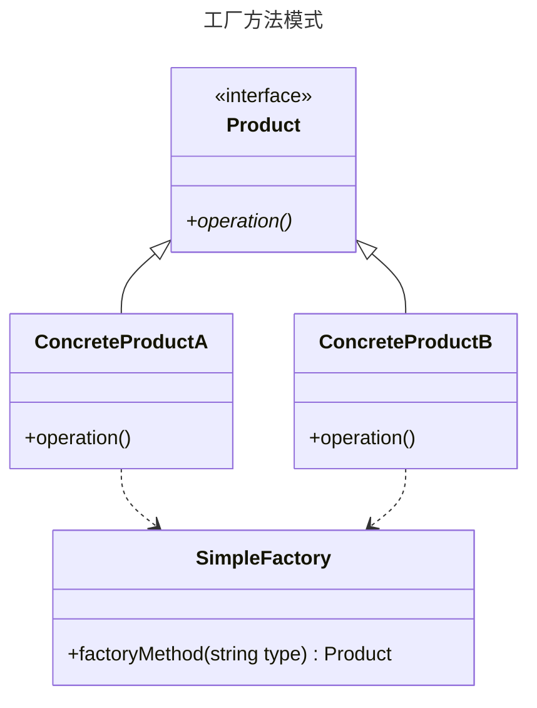

```mermaid
---
title: 工厂方法模式
---
classDiagram
    class Product {
        <<interface>>
        +operation()*
    }
    class ConcreteProductA {
        +operation()
    }
    class ConcreteProductB {
        +operation()
    }
    class SimpleFactory {
        +factoryMethod(string type) Product
    }
    Product <|-- ConcreteProductA 
    Product <|-- ConcreteProductB 
    ConcreteProductA ..> SimpleFactory 
    ConcreteProductB ..> SimpleFactory 
```