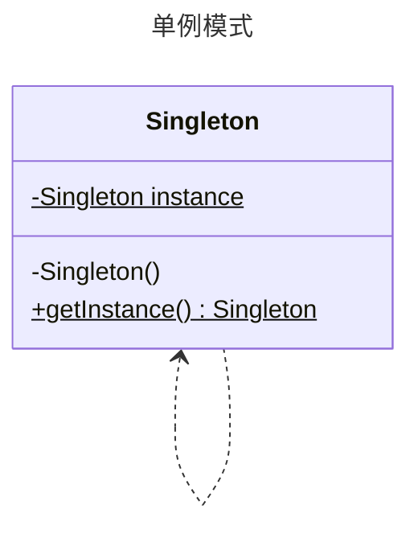
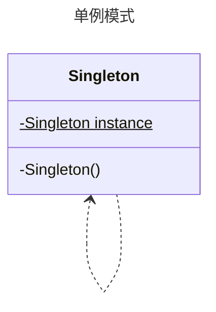

```mermaid
---
title: 单例模式
---
classDiagram
    class Singleton {
        -Singleton instance$
        -Singleton()
        +getInstance()$ Singleton
    }
    Singleton <.. Singleton
```

```mermaid
---
title: 单例模式
---
classDiagram
    class Singleton {
        -Singleton instance$
        -Singleton()
    }
    Singleton <.. Singleton
```