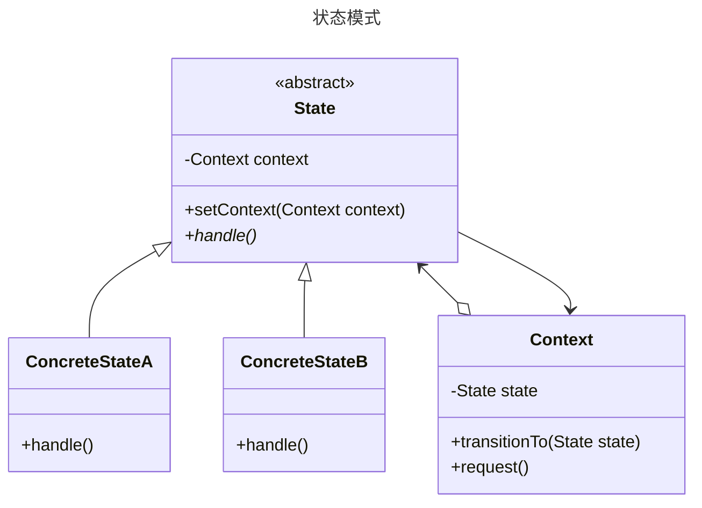

```mermaid
---
title: 状态模式
---
classDiagram
    class State {
        <<abstract>>
        -Context context
        +setContext(Context context)
        +handle()*
    }
    class ConcreteStateA {
        +handle()
    }
    class ConcreteStateB {
        +handle()
    }
    class Context {
        -State state
        +transitionTo(State state)
        +request()
    }
    State <|-- ConcreteStateA 
    State <|-- ConcreteStateB 
    State <--o Context 
    Context <-- State 
```