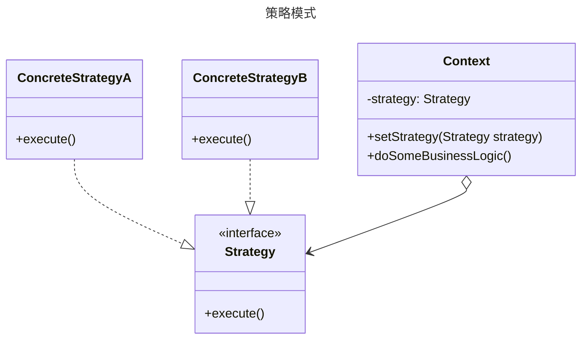

```mermaid
---
title: 策略模式
---
classDiagram
    class Strategy {
        <<interface>>
        +execute()
    }
    class ConcreteStrategyA {
        +execute()
    }
    class ConcreteStrategyB {
        +execute()
    }
    class Context {
        -strategy: Strategy
        +setStrategy(Strategy strategy)
        +doSomeBusinessLogic()
    }
    ConcreteStrategyA ..|> Strategy
    ConcreteStrategyB ..|> Strategy
    Context o--> Strategy
```