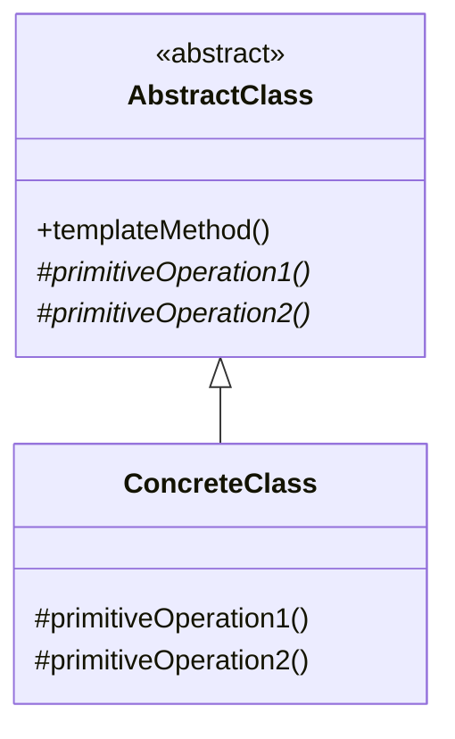

```mermaid
classDiagram
    class AbstractClass {
        +templateMethod()
        #primitiveOperation1()*
        #primitiveOperation2()*
    }
    <<abstract>> AbstractClass
    class ConcreteClass {
        #primitiveOperation1()
        #primitiveOperation2()
    }
    AbstractClass <|-- ConcreteClass
```