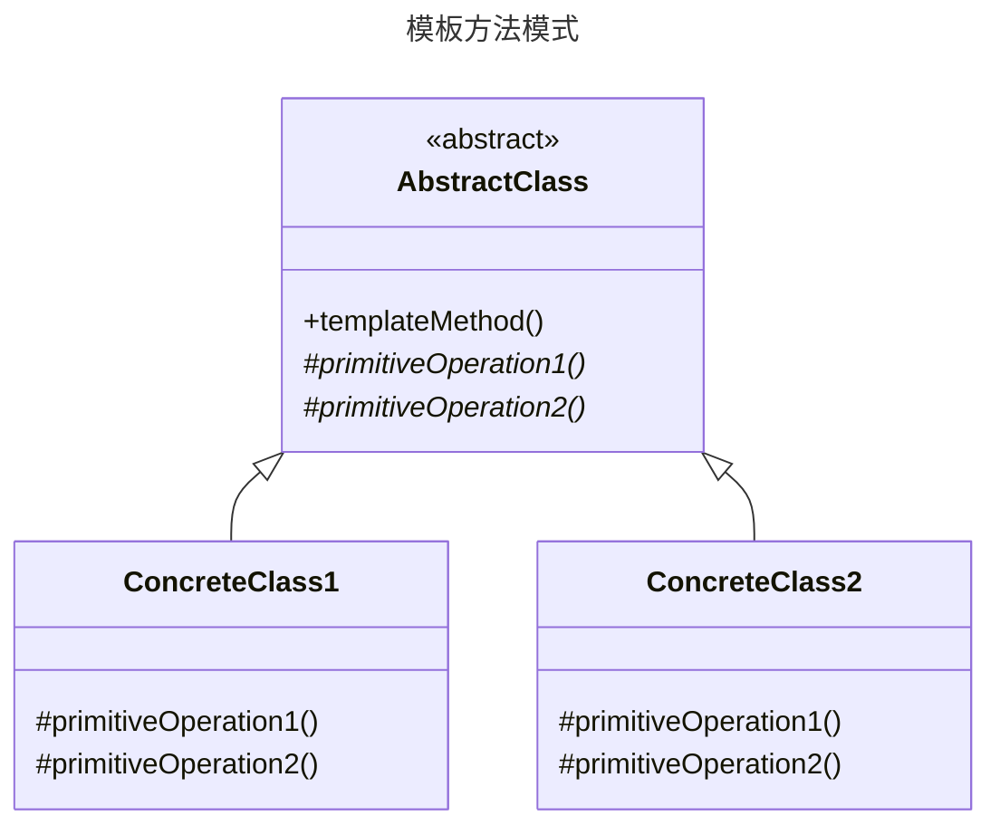

```mermaid
---
title: 模板方法模式
---
classDiagram
    class AbstractClass {
        <<abstract>>
        +templateMethod()
        #primitiveOperation1()*
        #primitiveOperation2()*
    }
    class ConcreteClass1 {
        #primitiveOperation1()
        #primitiveOperation2()
    }
    class ConcreteClass2 {
        #primitiveOperation1()
        #primitiveOperation2()
    }
    AbstractClass <|-- ConcreteClass1
    AbstractClass <|-- ConcreteClass2
```