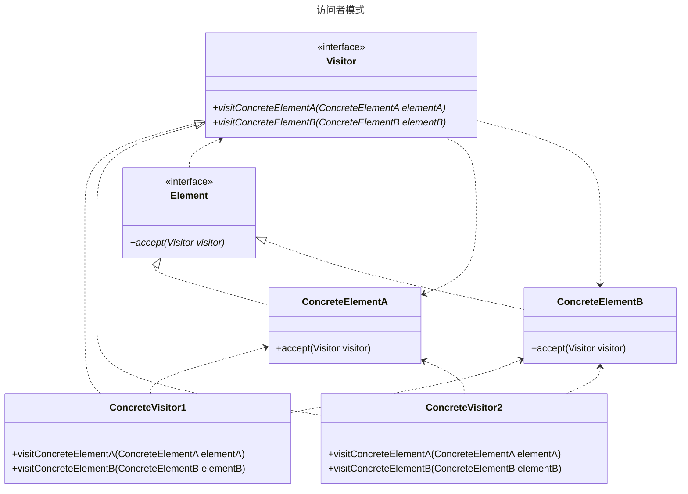

```mermaid
---
title: 访问者模式
---
classDiagram
    class Visitor {
        <<interface>>
        +visitConcreteElementA(ConcreteElementA elementA)*
        +visitConcreteElementB(ConcreteElementB elementB)*
    }
    class ConcreteVisitor1 {
        +visitConcreteElementA(ConcreteElementA elementA)
        +visitConcreteElementB(ConcreteElementB elementB)
    }
    class ConcreteVisitor2 {
        +visitConcreteElementA(ConcreteElementA elementA)
        +visitConcreteElementB(ConcreteElementB elementB)
    }
    class Element {
        <<interface>>
        +accept(Visitor visitor)*
    }
    class ConcreteElementA {
        +accept(Visitor visitor)
    }
    class ConcreteElementB {
        +accept(Visitor visitor)
    }
    Visitor <|.. ConcreteVisitor1
    Visitor <|.. ConcreteVisitor2
    Element <|.. ConcreteElementA
    Element <|.. ConcreteElementB
    ConcreteElementA <.. Visitor
    ConcreteElementB <.. Visitor
    Visitor <.. Element
    ConcreteElementA <.. ConcreteVisitor1
    ConcreteElementB <.. ConcreteVisitor1
    ConcreteElementA <.. ConcreteVisitor2
    ConcreteElementB <.. ConcreteVisitor2
```